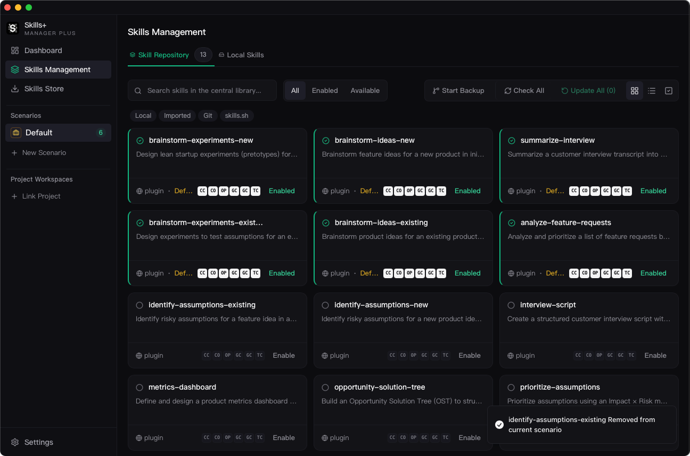

<p align="center">
  
</p>

<h1 align="center">Skills-Manager-Plus</h1>

<p align="center">
  A desktop app for building, organizing, syncing, and backing up AI agent skills across tools, scenarios, and project workspaces.
</p>

<p align="center">
  <a href="./README.zh-CN.md">中文说明</a>
</p>

<p align="center">
  
</p>

## Overview

Skills-Manager-Plus is a cross-tool skill manager for people who work with multiple AI coding agents. It gives you one central place to install skills, organize them by scenario, sync them to supported tools, compare them with project-local skill folders, and keep everything versioned with Git.

Instead of managing scattered `skills/` directories by hand, you maintain a central library and decide how each workflow should use it.

## What Problem It Solves

- Skills are usually scattered across different tools and machines.
- Different workflows need different active skill sets.
- Project-local skills drift away from central libraries over time.
- Backing up or migrating a skills library is easy to forget and hard to recover cleanly.

Skills-Manager-Plus addresses this with a central library, scenario-based switching, project workspace comparison, per-agent sync, and built-in Git backup.

## Key Capabilities

- **Central skill library** — Import skills from Git repositories, local folders, `.zip` or `.skill` archives, skills.sh, ClawHub, and plugin bundles.
- **Skills Management** — Review, tag, enable, disable, inspect, compare, and sync skills from one management surface.
- **Skills Store** — Install from marketplace sources, Git repositories, local scans, ClawHub, and plugin markets.
- **Scenarios** — Keep separate skill sets for different workflows, clients, or projects, then switch between them quickly.
- **Project Workspaces** — Compare project-local skills against the central library and move changes in either direction.
- **Per-agent sync** — Sync with symlink or copy mode, including independent sync mode for custom agents.
- **Git backup** — Create snapshot-based history for backup, recovery, and multi-machine sync.

## What This Fork Adds

This fork extends the original `skills-manager` with deeper workflow coverage around discovery, local management, custom agents, and plugin distribution.

### ClawHub Integration

- Built-in ClawHub search and browsing flow.
- API key configuration in `Settings`.
- Integrated into the installation workflow instead of being a separate external step.

### Better Local Skills Workflow

- `Skills Management` separates `Skill Repository` and `Local Skills`.
- Local scan and import are part of the main management workflow.
- Batch import, source filtering, and description inference improve large local libraries.

### Custom Agent Sync Control

- Each custom agent can use its own sync mode.
- Sync behavior can differ from the global default.
- Path and symlink handling are more robust during sync operations.

### Plugin Marketplace Support

- Add plugin market sources from GitHub repositories.
- Discover plugin bundles and install packaged skills directly in-app.
- Track plugin-installed skills separately from the rest of the library.

### Standalone Product Identity

- Separate bundle ID, updater channel, config directory, repo path, and database file.
- Can coexist with the original Skills Manager on the same machine.

## Product Structure

The current app is organized around these modules:

- `Dashboard`
- `Skills Management`
- `Skills Store`
- `Scenarios`
- `Project Workspaces`
- `Settings`

Detailed usage guides for each module live in [docs/usage/README.md](./docs/usage/README.md).

## Documentation

- [Usage Overview](./docs/usage/overview.md)
- [Dashboard](./docs/usage/dashboard.md)
- [Skills Store](./docs/usage/skills-store.md)
- [Skills Management](./docs/usage/skills-management.md)
- [Scenarios](./docs/usage/scenarios.md)
- [Project Workspaces](./docs/usage/project-workspaces.md)
- [Settings](./docs/usage/settings.md)
- [Git Backup](./docs/usage/git-backup.md)

## Supported Tools

Cursor · Claude Code · Codex · OpenCode · Amp · Kilo Code · Roo Code · Goose · Gemini CLI · GitHub Copilot · Windsurf · TRAE IDE · Antigravity · Clawdbot · Droid

You can also add custom tools in `Settings`.

## Quick Start

1. Create or switch to a scenario.
2. Open `Skills Store` to import skills from marketplace, Git, local folders, ClawHub, or plugins.
3. Open `Skills Management` to decide which skills belong to the current scenario.
4. Sync enabled skills to installed tools.
5. Use `Project Workspaces` if you need to compare or exchange project-local skills.
6. Configure `Git Backup` if you want history, restore points, or multi-machine sync.

## Development

### Prerequisites

- Node.js 18+
- Rust toolchain
- [Tauri prerequisites](https://v2.tauri.app/start/prerequisites/) for your OS

### Run Locally

```bash
npm install
npm run tauri:dev
```

### Build

```bash
npm run tauri:build
```

## Troubleshooting

### macOS: "App is damaged and can't be opened"

If macOS blocks the downloaded app, run:

```bash
xattr -cr /Applications/Skills-Manager-Plus.app
```

Replace the path if the `.app` file is stored somewhere else.

## Acknowledgments

Skills-Manager-Plus is a fork of [skills-manager](https://github.com/xingkongliang/skills-manager) `v1.14.1`.

Respect to the original project for building the foundation of cross-tool AI skill management.

## License

MIT
