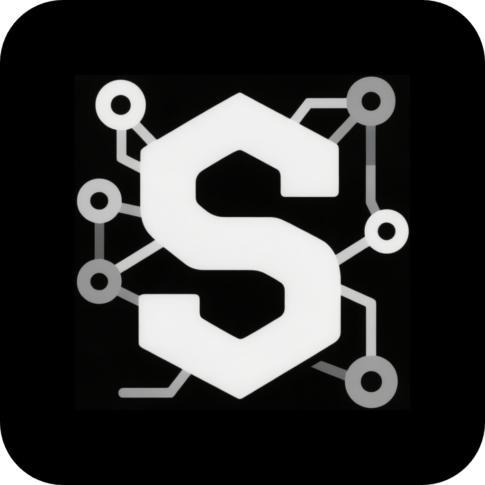

<p align="center">
  
</p>

<h1 align="center">Skills-Manager-Plus</h1>

<p align="center">
  一款桌面应用，用统一入口管理 AI Agent Skills 的安装、整理、同步、项目协作与 Git 备份。
</p>

<p align="center">
  <a href="./README.md">English</a>
</p>

<p align="center">
  
</p>

## 项目简介

Skills-Manager-Plus 是一个面向多工具、多场景、多项目工作流的 AI Skills 管理器。它提供一个统一的中央库，用来安装、整理、启用、同步和备份 Skills，并支持将项目本地 Skills 与中央库进行对比和双向流转。

相比手动维护分散在不同工具目录中的 `skills/` 文件夹，这个项目把技能管理收拢成一套可持续维护的工作流。

## 它解决什么问题

- Skills 分散在不同工具和不同机器中，难以统一管理。
- 不同工作流需要不同的启用技能组合。
- 项目内本地 Skills 与中央库容易逐渐偏离。
- 备份、迁移、恢复 Skills 库通常依赖手工维护，成本高且不稳定。

Skills-Manager-Plus 通过中央库、场景切换、项目工作区、按 Agent 同步和 Git 备份来解决这些问题。

## 核心能力

- **中央技能库** — 从 Git 仓库、本地目录、`.zip` 或 `.skill` 压缩包、skills.sh、ClawHub 和插件包中导入 Skills。
- **技能管理** — 在一个界面里查看、打标签、启用、停用、预览、比较和同步 Skills。
- **技能商店** — 从市场、Git、本地扫描、ClawHub 和插件市场安装 Skills。
- **场景管理** — 为不同工作流、客户或项目维护不同的技能组合。
- **项目工作区** — 将项目本地 Skills 与中央库进行对比，并支持双向导入导出。
- **按 Agent 同步** — 支持软链接或复制模式，并允许自定义 Agent 使用独立同步策略。
- **Git 备份** — 提供快照式版本历史，用于备份、恢复和多机同步。

## 这个 Fork 增加了什么

这个 Fork 在原版 `skills-manager` 的基础上，重点补强了技能发现、本地管理、自定义 Agent 和插件分发相关能力。

### ClawHub 集成

- 内置 ClawHub 搜索和浏览流程。
- 在 `设置` 中直接配置 API Key。
- 成为安装工作流的一部分，而不是额外的外部步骤。

### 更完善的本地 Skills 工作流

- `技能管理` 页面拆分为 `技能仓库` 和 `本地技能`。
- 本地扫描和导入进入主工作流。
- 支持批量导入、来源筛选和描述推断，更适合大型本地技能库。

### 自定义 Agent 同步控制

- 每个自定义 Agent 可以独立设置同步模式。
- 自定义同步策略不必跟随全局默认值。
- 同步过程中的路径和符号链接处理更稳健。

### 插件市场支持

- 可从 GitHub 仓库添加插件市场源。
- 可发现插件包并直接在应用内安装其打包技能。
- 可单独追踪通过插件安装的 Skills。

### 独立产品标识

- 使用独立的 Bundle ID、更新通道、配置目录、仓库路径和数据库文件。
- 可以与原版 Skills Manager 在同一台机器上共存。

## 产品结构

当前应用按这些模块组织：

- `数据看板`
- `技能管理`
- `技能商店`
- `场景`
- `项目工作区`
- `设置`

完整使用文档位于 [docs/usage/zh-CN/README.md](./docs/usage/zh-CN/README.md)。

## 文档导航

- [使用总览](./docs/usage/zh-CN/overview.md)
- [数据看板](./docs/usage/zh-CN/dashboard.md)
- [技能商店](./docs/usage/zh-CN/skills-store.md)
- [技能管理](./docs/usage/zh-CN/skills-management.md)
- [场景](./docs/usage/zh-CN/scenarios.md)
- [项目工作区](./docs/usage/zh-CN/project-workspaces.md)
- [设置](./docs/usage/zh-CN/settings.md)
- [Git 备份](./docs/usage/zh-CN/git-backup.md)

## 支持的工具

Cursor · Claude Code · Codex · OpenCode · Amp · Kilo Code · Roo Code · Goose · Gemini CLI · GitHub Copilot · Windsurf · TRAE IDE · Antigravity · Clawdbot · Droid

你也可以在 `设置` 中添加自定义工具。

## 快速上手

1. 创建或切换到一个场景。
2. 打开 `技能商店`，从市场、Git、本地、ClawHub 或插件市场导入 Skills。
3. 打开 `技能管理`，决定当前场景需要启用哪些 Skills。
4. 将启用的 Skills 同步到已安装工具。
5. 如果需要处理项目本地 Skills，使用 `项目工作区`。
6. 如果需要历史记录、恢复点或多机同步，配置 `Git 备份`。

## 开发

### 前置依赖

- Node.js 18+
- Rust 工具链
- 当前系统的 [Tauri 依赖](https://v2.tauri.app/start/prerequisites/)

### 本地运行

```bash
npm install
npm run tauri:dev
```

### 构建

```bash
npm run tauri:build
```

## 常见问题

### macOS 提示 "App is damaged and can't be opened"

如果 macOS 阻止打开下载后的应用，执行：

```bash
xattr -cr /Applications/Skills-Manager-Plus.app
```

如果 `.app` 不在 `/Applications`，请替换为实际路径。

## 致谢

Skills-Manager-Plus 基于 [skills-manager](https://github.com/xingkongliang/skills-manager) `v1.14.1` 二次开发。

感谢原项目为跨工具 AI Skills 管理打下的基础。

## License

MIT
