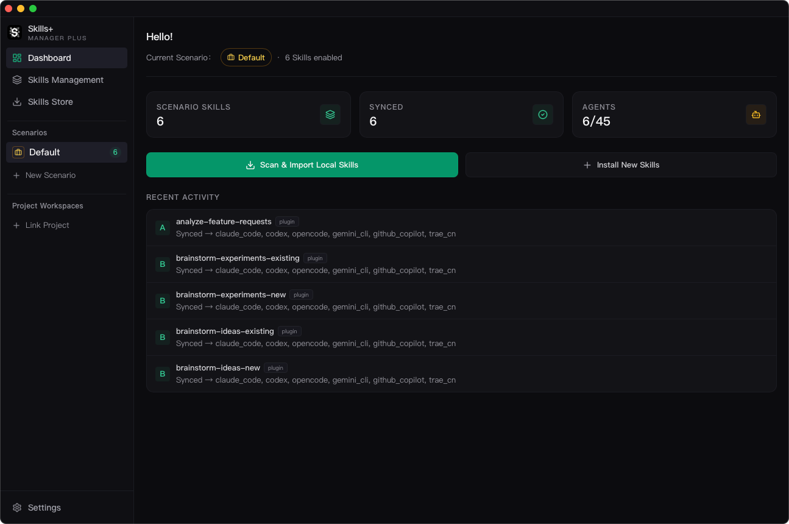

# Dashboard

## Purpose

`Dashboard` is the quick-glance home page. It shows the active scenario, how many skills are enabled, how many are already synced, and how many supported agents are installed.

## What You Can Do Here

- Confirm which scenario is currently active.
- See how many scenario skills are enabled.
- See how many skills are already synced to tools.
- Jump directly to local-scan import or the store.
- Open recently active skills and jump into `Skills Management`.

## Best Use

Use `Dashboard` as a status surface, not as the main editing surface. Most real management work happens in `Skills Management`, `Skills Store`, and `Project Workspaces`.
