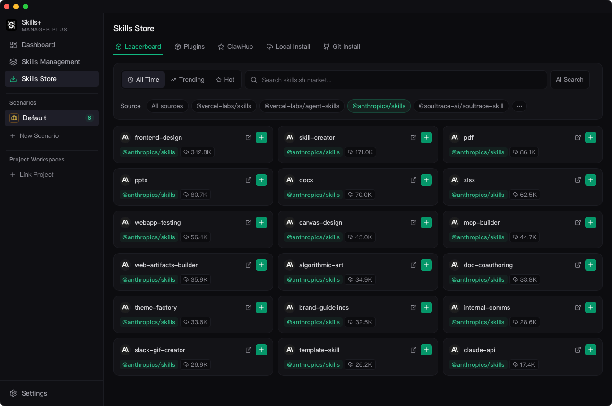
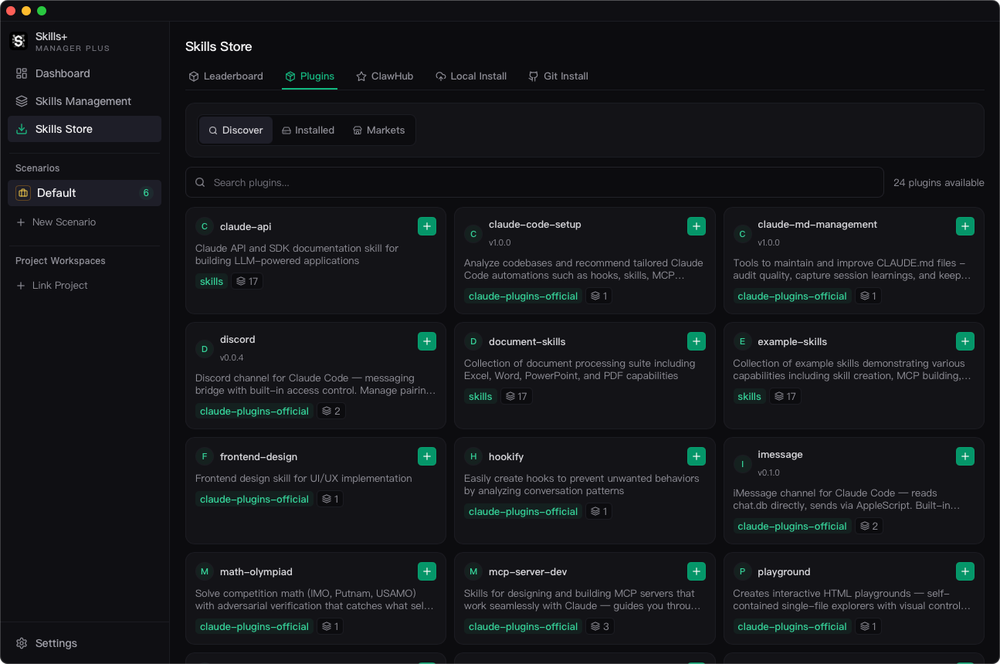

# Skills Store

## Purpose

`Skills Store` is the import hub for bringing skills into the central library.

## Available Sources

- `Marketplace`: browse and search skills.sh content.
- `ClawHub`: browse and search ClawHub skills after configuring an API key.
- `Local`: scan a local directory and batch-import discovered skills.
- `Git`: preview a repository and import one or more skill directories from it.
- `Plugin Marketplace`: add plugin market sources from GitHub repositories and install packaged skill bundles.

## Main Workflows

### Marketplace Import

- Browse hot, trending, or all-time entries.
- Search by keyword.
- Import directly into the central library.

### ClawHub Import

- Configure the ClawHub API key in `Settings`.
- Search skills or browse by sort mode.
- Install selected skills into the central library.

### Local Scan and Import

- Choose a directory.
- Let the app scan for valid skill folders.
- Review detected entries and import one or many into the central library.

### Git Import

- Paste a Git repository URL.
- Preview detected skill directories before import.
- Select one or more skill folders to install.

### Plugin Marketplace

- Add a plugin market source from a GitHub repository.
- Refresh the market cache.
- Browse packaged plugin entries and install their bundled skills.

## When To Use It

Use `Skills Store` whenever you want to add new skills into the central library. Once imported, switch to `Skills Management` to decide how those skills should be enabled, tagged, reviewed, or synced.
