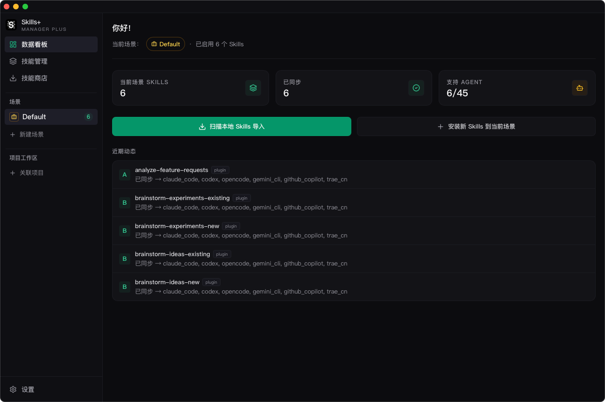

# 数据看板

## 作用

`数据看板` 是快速总览首页。它展示当前场景、已启用技能数量、已同步技能数量，以及已安装支持 Agent 的数量。

## 这里能做什么

- 确认当前正在使用哪个场景。
- 查看当前场景启用了多少 Skills。
- 查看有多少 Skills 已经同步到工具。
- 快速跳转到本地扫描导入或技能商店。
- 打开最近活跃的 Skills，并跳转到 `技能管理`。

## 最佳用途

把 `数据看板` 当作状态页，而不是主要操作页。真正的管理动作主要发生在 `技能管理`、`技能商店` 和 `项目工作区`。
