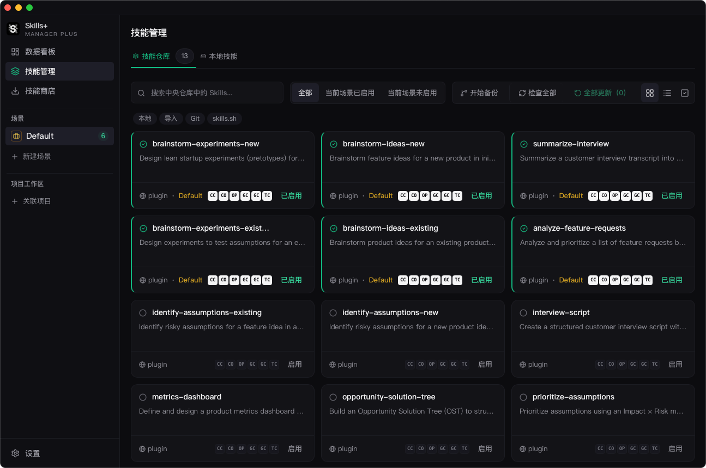

# 技能管理

## 作用

`技能管理` 是中央库的主操作界面。

## 标签页

- `技能仓库`：中央库和当前场景管理。
- `本地技能`：本地扫描结果和导入流程。

## 这里能做什么

- 搜索和筛选 Skills。
- 为当前场景启用或停用 Skills。
- 将 Skills 同步到支持工具，或取消同步。
- 查看技能文档和元数据。
- 在可用时对比本地内容与上游内容。
- 检查更新并刷新导入技能。
- 编辑标签并进行批量操作。
- 在配置 Git 备份后查看版本历史。

## 关键行为

### 按场景启用

中央库不等于当前场景。一个 Skill 可以存在于中央库中，但并未在当前场景启用。

### 按 Agent 同步

每个 Skill 都可以同步到一个或多个已安装工具，同步覆盖情况会直接显示在管理界面中。

### 保留来源信息

当 Skills 来自 Git、市场、ClawHub 或插件时，应用会保留来源元数据，用于后续更新检查或上游对比。

### 批量操作

你可以一次选中多个 Skills，批量执行启用、删除、标签或更新动作，而不需要逐个处理。

## 最佳实践

先用 `技能商店` 把 Skills 导入中央库，再用 `技能管理` 作为长期控制面来决定哪些技能保持活跃、如何组织，以及同步到哪些工具。
