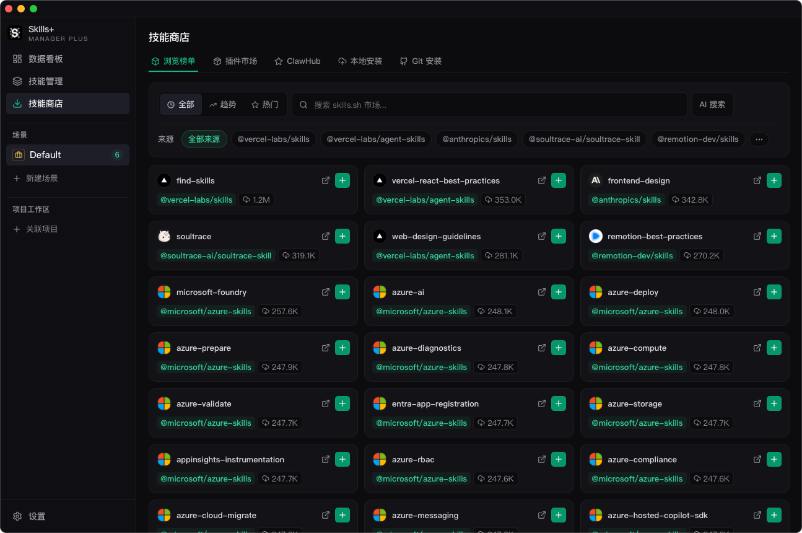
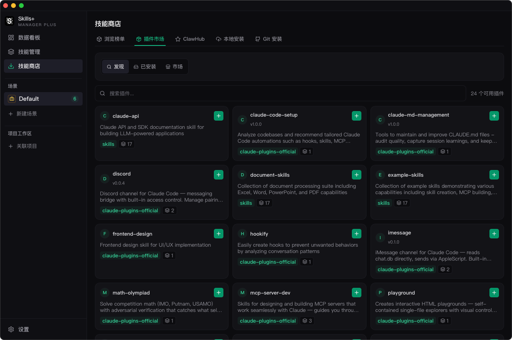

# 技能商店

## 作用

`技能商店` 是将外部 Skills 导入中央库的入口。

## 可用来源

- `Marketplace`：浏览和搜索 skills.sh 内容。
- `ClawHub`：在配置 API Key 后浏览和搜索 ClawHub Skills。
- `Local`：扫描本地目录，并批量导入检测到的 Skills。
- `Git`：预览 Git 仓库中的技能目录，并按目录导入。
- `Plugin Marketplace`：添加插件市场源，并安装插件打包的技能集合。

## 主要工作流

### Marketplace 导入

- 浏览热门、趋势或全时榜单。
- 按关键词搜索。
- 直接导入中央库。

### ClawHub 导入

- 先在 `设置` 中配置 ClawHub API Key。
- 搜索技能或按排序方式浏览。
- 将选中的技能安装到中央库。

### 本地扫描导入

- 选择一个目录。
- 让应用扫描其中的有效 Skill 文件夹。
- 审核结果后，单个或批量导入中央库。

### Git 导入

- 填入 Git 仓库地址。
- 先预览仓库内识别到的技能目录。
- 选择一个或多个目录导入。

### 插件市场

- 从 GitHub 仓库添加插件市场源。
- 刷新市场缓存。
- 浏览插件条目并安装其打包技能。

## 什么时候使用

当你想把新 Skills 带入中央库时，使用 `技能商店`。导入完成后，再切换到 `技能管理`，决定这些技能如何启用、整理、审核和同步。
